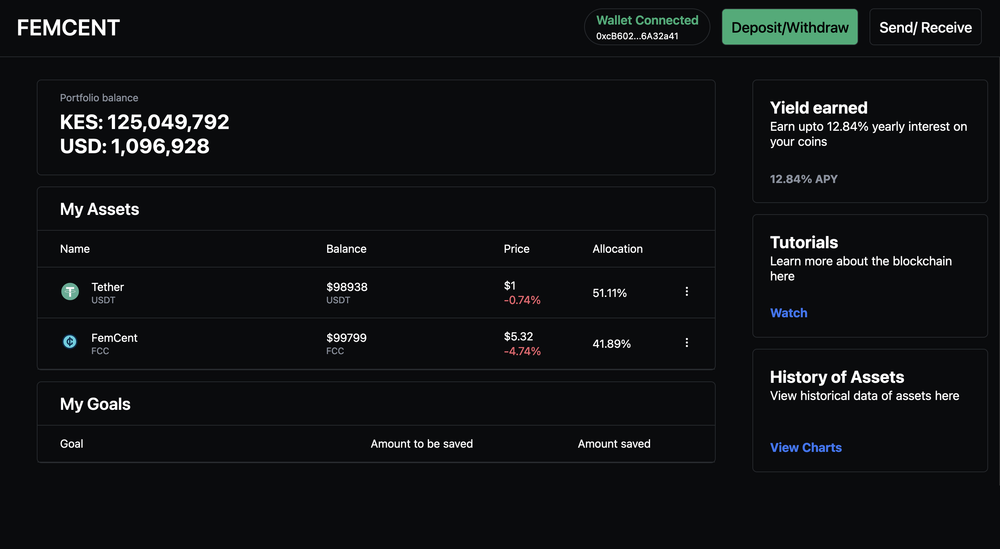
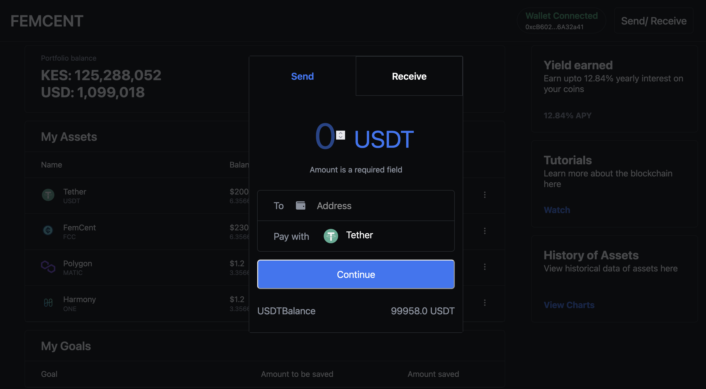
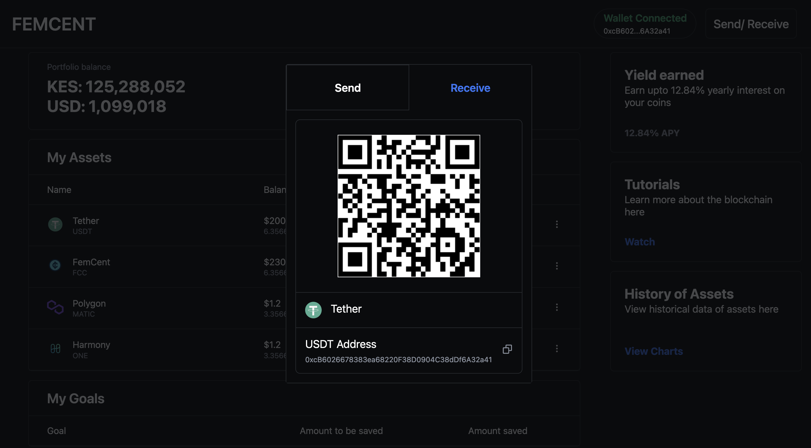

## FEMCENT

In a study conducted by the World Bank, it was shown that Africa is the only region in the world with more women entrepreneurs, yet it is estimated that women earn 32% less than their male counterparts. Furthermore, 66% of those living in Sub-Saharan Africa have no access to a traditional bank account. This has led to the emergence of alternative financial services such as saccos and microsavings groups which have been widely adopted by women in Africa.

In addition, opening a USD account for most Africans was out of reach but with the emergence of Blockchain Technology, we conceptualized FEMCENT, a blockchain savings and investments platform. This platform creates a solution in which members can save in digital currencies known as ‘stable coins’ which are fully backed by U.S. dollar assets and offer competitive return on investments.

On a wider scale, this platform will not only positively impact the local communities but can also be scaled to other African communities, to positively impact the savings and investments platforms they have access to.

## A preview of the app's interface.

